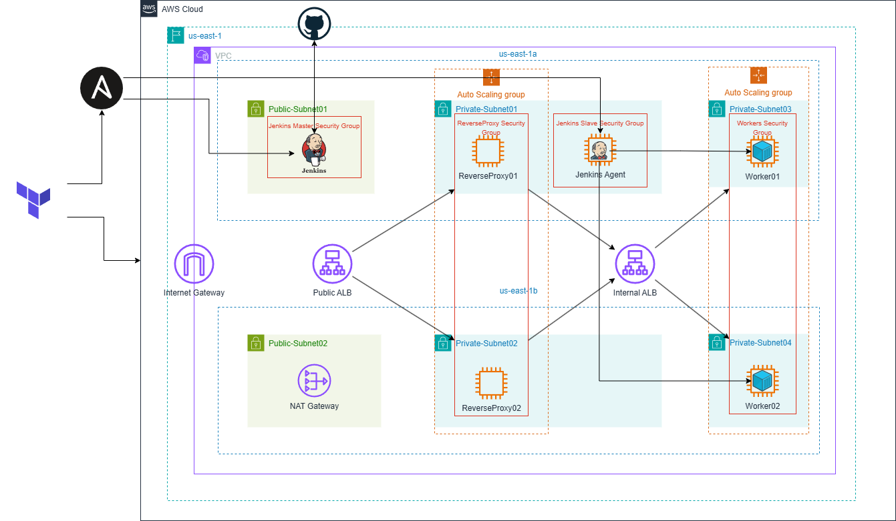
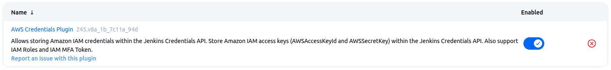
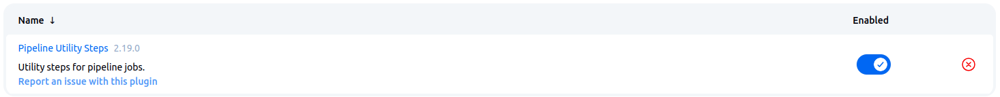
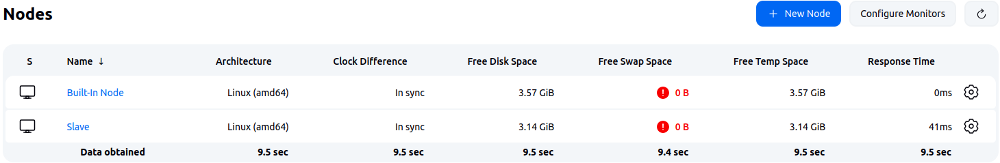
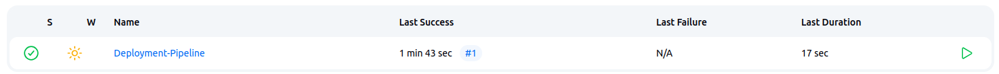
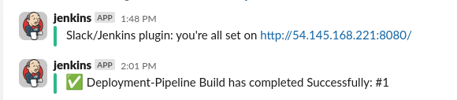
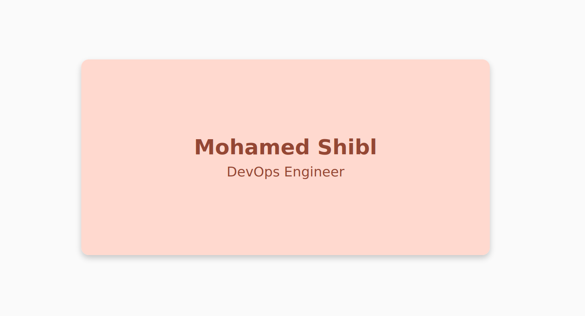

# CI-CD-Autoscaling-Application

## 🧱 Project Architecture


This project sets up a CI/CD pipeline using Jenkins, with infrastructure provisioned via Terraform and configuration managed through Ansible. 

featuring a Master-Slave Jenkins architecture and supports GitHub webhooks for continuous deployment and dynamic update of provisioned instances.

---

## 🛠 Technologies Used

- Terraform
- Ansible
- Jenkins
- Docker
- Bash / Shell Scripts

---

## 📂 Directory Structure

```
.
├── Ansible/
│   ├── master-playbook.yml
│   ├── slave-playbook.yml
│   ├── backend-playbook.yml
│   └── roles
│       ├── master
│       ├── slave
│       └── backend
├── Terraform/
│   ├── Modules/
│   │   ├── ALB
│   │   ├── ASG
│   │   ├── EC2
│   │   ├── KeyPair
│   │   ├── SecurityGroup
│   │   └── VPC
│   └── main.tf
├── Scripts/
│   ├── InventoryGen.sh
│   └── SSH-Config.sh
├── index.html
├── Dockerfile
├── Jenkinsfile
└── README.md
```
---

## 🚀 Project Steps

### 1. Provisioning Infrastructure with Terraform

We begin by provisioning the infrastructure using Terraform.

```bash
cd Terraform
terraform init
terraform apply --auto-approve
```

---

### 2. Setting up Jenkins Instances with Ansible

Once the instances are up, local provisioners in Terraform trigger Ansible playbooks to:

- Install Jenkins on the Master node.
- Configure the Slave node with the necessary dependencies and SSH keys for communication.

```yaml
resource "null_resource" "Master_Startup" {
  depends_on = [module.ProxyAutoScaling, module.PrivateAutoScaling]
  provisioner "local-exec" {
    command = <<EOT
      bash ${var.WorkDir}/Scripts/SSH-Config.sh "${module.KeyPair.Key_Path}"
      ANSIBLE_CONFIG=${var.WorkDir}/Ansible/ansible.cfg \
      ansible-playbook -i ${var.WorkDir}/Ansible/inventory ${var.WorkDir}/Ansible/master-playbook.yml
    EOT
  }
}

resource "null_resource" "JumpServerScript" {
  depends_on = [null_resource.Master_Startup]
  provisioner "local-exec" {
    command = <<EOT
      bash ../Scripts/InventoryGen.sh
      ansible-playbook -i ../Ansible/inventory ../Ansible/slave-playbook.yml
    EOT
  }
}
```

---

### 3. Configuring Jenkins Instances

Next, we log into the Jenkins master via the web interface and:
- **Install Required Plugins**


- **Add a new node for the slave**


---

### 4. Creating the CI/CD Pipeline

We then create a **Pipeline Job** in Jenkins:

- Connect it to a GitHub repository.
- Configure the webhook in GitHub to notify Jenkins of code changes.
- Integrate Slack notifications

---

### 5. Automatic Deployment of Application

Upon Pipeline trigger, the following occurs:

- Detect newly provisioned instances
- Pull the latest application code
- Build a new docker Image
- Configure new instances and deploy and the application automatically
- Job status sent to Slack




---

### 6. Accessing the demo application through the public load balancer



---

## 📌 Summary

- **Infrastructure**: Provisioned with Terraform
- **Configuration**: Managed by Ansible
- **CI/CD Tool**: Jenkins (Master-Slave setup)
- **Trigger**: GitHub Webhook
- **Goal**: Automate deployment of latest application version

---

## 🧑‍💻 Author

**Mohamed Shibl** <br>
🔗 [LinkedIn](https://www.linkedin.com/in/mohamed-gshibl/) <br>
📧 [mohamed.gshibl@gmail.com](mailto:mohamed.gshibl@gmail.com)
